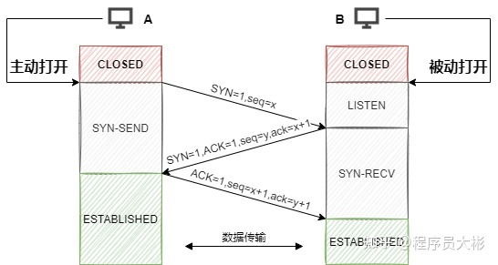
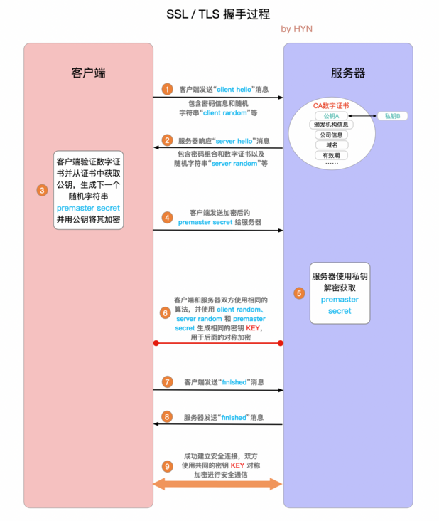

# 计算机网络

五层模型：应用层、传输层、网络层、数据链路层、物理层.

## TCP 协议

### 三次握手

1. 第一次握手：客户端向服务端发起建立连接请求，客户端会随机生成一个起始序列号x，客户端向服务端发送的字段中包含标志位`SYN=1`，序列号`seq=x`。第一次握手前客户端的状态为`CLOSE`，第一次握手后客户端的状态为`SYN-SENT`。此时服务端的状态为`LISTEN`。
2. 第二次握手：服务端在收到客户端发来的报文后，会随机生成一个服务端的起始序列号y，然后给客户端回复一段报文，其中包括标志位`SYN=1`，`ACK=1`，序列号`seq=y`，确认号`ack=x+1`。第二次握手前服务端的状态为`LISTEN`，第二次握手后服务端的状态为`SYN-RCVD`，此时客户端的状态为`SYN-SENT`。（其中`SYN=1`表示要和客户端建立一个连接，`ACK=1`表示确认序号有效）
3. 第三次握手：客户端收到服务端发来的报文后，会再向服务端发送报文，其中包含标志位`ACK=1`，序列号`seq=x+1`，确认号`ack=y+1`。第三次握手前客户端的状态为`SYN-SENT`，第三次握手后客户端和服务端的状态都为`ESTABLISHED`。此时连接建立完成。

**两次握手可以吗？**

第三次握手主要为了防止已失效的连接请求报文段突然又传输到了服务端，导致产生问题。

- 比如客户端A发出连接请求，可能因为网络阻塞原因，A没有收到确认报文，于是A再重传一次连接请求。
- 连接成功，等待数据传输完毕后，就释放了连接。
- 然后A发出的第一个连接请求等到连接释放以后的某个时间才到达服务端B，此时B误认为A又发出一次新的连接请求，于是就向A发出确认报文段。
- 如果不采用三次握手，只要B发出确认，就建立新的连接了，此时A不会响应B的确认且不发送数据，则B一直等待A发送数据，浪费资源。

### 四次挥手

1. A的应用进程先向其TCP发出连接释放报文段（`FIN=1，seq=u`），并停止再发送数据，主动关闭TCP连接，进入`FIN-WAIT-1`（终止等待1）状态，等待B的确认。
2. B收到连接释放报文段后即发出确认报文段（`ACK=1，ack=u+1，seq=v`），B进入`CLOSE-WAIT`（关闭等待）状态，此时的TCP处于半关闭状态，A到B的连接释放。
3. A收到B的确认后，进入`FIN-WAIT-2`（终止等待2）状态，等待B发出的连接释放报文段。
4. B发送完数据，就会发出连接释放报文段（`FIN=1，ACK=1，seq=w，ack=u+1`），B进入`LAST-ACK`（最后确认）状态，等待A的确认。
5. A收到B的连接释放报文段后，对此发出确认报文段（`ACK=1，seq=u+1，ack=w+1`），A进入`TIME-WAIT`（时间等待）状态。此时TCP未释放掉，需要经过时间等待计时器设置的时间`2MSL`（最大报文段生存时间）后，A才进入`CLOSED`状态。B收到A发出的确认报文段后关闭连接，若没收到A发出的确认报文段，B就会重传连接释放报文段。

**第四次挥手为什么要等待2MSL？**

- 保证A发送的最后一个ACK报文段能够到达B。这个`ACK`报文段有可能丢失，B收不到这个确认报文，就会超时重传连接释放报文段，然后A可以在`2MSL`时间内收到这个重传的连接释放报文段，接着A重传一次确认，重新启动2MSL计时器，最后A和B都进入到`CLOSED`状态，若A在`TIME-WAIT`状态不等待一段时间，而是发送完ACK报文段后立即释放连接，则无法收到B重传的连接释放报文段，所以不会再发送一次确认报文段，B就无法正常进入到`CLOSED`状态。
- 防止已失效的连接请求报文段出现在本连接中。A在发送完最后一个`ACK`报文段后，再经过2MSL，就可以使这个连接所产生的所有报文段都从网络中消失，使下一个新的连接中不会出现旧的连接请求报文段。

**为什么是四次挥手？**

因为当Server端收到Client端的`SYN`连接请求报文后，可以直接发送`SYN+ACK`报文。但是在关闭连接时，当Server端收到Client端发出的连接释放报文时，很可能并不会立即关闭SOCKET，所以Server端先回复一个`ACK`报文，告诉Client端我收到你的连接释放报文了。只有等到Server端所有的报文都发送完了，这时Server端才能发送连接释放报文，之后两边才会真正的断开连接。故需要四次挥手。

## HTTP

### POST和GET的区别？

- GET请求参数通过URL传递，POST的参数放在请求体中。
- GET产生一个TCP数据包；POST产生两个TCP数据包。对于GET方式的请求，浏览器会把请求头和请求体一并发送出去；而对于POST，浏览器先发送请求头，服务器响应100 continue，浏览器再发送请求体。
- GET请求会被浏览器主动缓存，而POST不会，除非手动设置。
- GET请求参数会被完整保留在浏览器历史记录里，而POST中的参数不会被保留。

### HTTP1.1和 HTTP2.0的区别？

HTTP2.0相比HTTP1.1支持的特性：

- 新的二进制格式：HTTP1.1 基于文本格式传输数据；HTTP2.0采用二进制格式传输数据，解析更高效。
- 多路复用：在一个连接里，允许同时发送多个请求或响应，并且这些请求或响应能够并行的传输而不被阻塞，避免 HTTP1.1 出现的”队头堵塞”问题。
- 头部压缩，HTTP1.1的header带有大量信息，而且每次都要重复发送；HTTP2.0 把header从数据中分离，并封装成头帧和数据帧，使用特定算法压缩头帧，有效减少头信息大小。并且HTTP2.0在客户端和服务器端记录了之前发送的键值对，对于相同的数据，不会重复发送。比如请求a发送了所有的头信息字段，请求b则只需要发送差异数据，这样可以减少冗余数据，降低开销。
- 服务端推送：HTTP2.0允许服务器向客户端推送资源，无需客户端发送请求到服务器获取。

### 什么是数字证书？

服务端可以向证书颁发机构CA申请证书，以避免中间人攻击（防止证书被篡改）。证书包含三部分内容：证书内容、证书签名算法和签名，签名是为了验证身份。

服务端把证书传输给浏览器，浏览器从证书里取公钥。证书可以证明该公钥对应本网站。

数字签名的制作过程：

1. CA使用证书签名算法对证书内容进行hash运算。
2. 对hash后的值用CA的私钥加密，得到数字签名。

浏览器验证过程：

1. 获取证书，得到证书内容、证书签名算法和数字签名。
2. 用CA机构的公钥对数字签名解密（由于是浏览器信任的机构，所以浏览器会保存它的公钥）。
3. 用证书里的签名算法对证书内容进行hash运算。
4. 比较解密后的数字签名和对证书内容做hash运算后得到的哈希值，相等则表明证书可信。

### HTTPS原理

1. **"client hello"消息：**客户端通过发送"client hello"消息向服务器发起握手请求，该消息包含了客户端所支持的 TLS 版本和密码组合以供服务器进行选择，还有一个"client random"随机字符串。
2. **"server hello"消息：**服务器发送"server hello"消息对客户端进行回应，该消息包含了数字证书，服务器选择的密码组合和"server random"随机字符串。
3. **验证：**客户端对服务器发来的证书进行验证，确保对方的合法身份，验证过程可以细化为以下几个步骤：
   1. 检查数字签名
   2. 验证证书链 (这个概念下面会进行说明)
   3. 检查证书的有效期
   4. 检查证书的撤回状态 (撤回代表证书已失效)
4. **"premaster secret"字符串：**客户端向服务器发送另一个随机字符串"premaster secret (预主密钥)"，这个字符串是经过服务器的公钥加密过的，只有对应的私钥才能解密。
5. **使用私钥：**服务器使用私钥解密"premaster secret"。
6. **生成共享密钥**：客户端和服务器均使用 client random，server random 和 premaster secret，并通过相同的算法生成相同的共享密钥 **KEY**。
7. **客户端就绪：**客户端发送经过共享密钥 **KEY**加密过的"finished"信号。
8. **服务器就绪：**服务器发送经过共享密钥 **KEY**加密过的"finished"信号。
9. **达成安全通信：**握手完成，双方使用对称加密进行安全通信。

## DNS

### DNS 的解析过程？

1. 浏览器搜索自己的DNS缓存
2. 若没有，则搜索操作系统中的DNS缓存和hosts文件
3. 若没有，则操作系统将域名发送至本地域名服务器，本地域名服务器查询自己的DNS缓存，查找成功则返回结果，否则依次向根域名服务器、顶级域名服务器、权限域名服务器发起查询请求，最终返回IP地址给本地域名服务器
4. 本地域名服务器将得到的IP地址返回给操作系统，同时自己也将IP地址缓存起来
5. 操作系统将 IP 地址返回给浏览器，同时自己也将IP地址缓存起来

